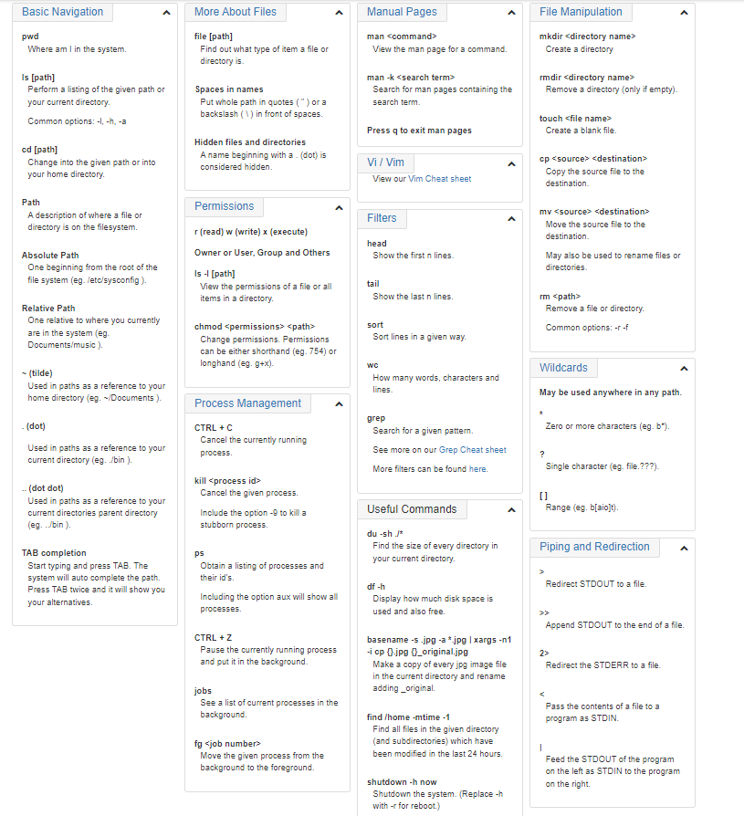

# Practice in the Terminal

###### notes taken from <https://ryanstutorials.net/linuxtutorial/commandline.php>

## The Command Line

 The command line, also called the terminal, is a text based interface that allows access to the system.

 It is typically represented by a prompt and is used to enter commands to the computer.

 One advantage to using the terminal is you can have several open at once each doing seperate tasks at the same time.

 The terminal uses a shell which determines how the teminal behaves with the commands given.

## Basic Navigation

Navigating around the system is crucial to the effective use of the command line.

Commands:

- pwd: Print Working Directory
- ls: short for list and gives a list of items in the directory.

Absolute and Relative Paths:

- Absolute Path:  specify a location (file or directory) in relation to the root directory.
- Relative Path: specify a location (file or directory) in relation to where we currently are in the system.

## More About Files

Every thing is a file.

Linux is an Extensionless System??

- Unlike windows, Linux looks into the file to determine what type of file it is.

One of the things that can make Linux difficult is the fact that is is case sensitive.

You can put "" around names with spaces in them. A \ can do the same thing.

## Manual Pages

You can look up commands with "man" followed by the command.  "man" is short for manual and will give you information on the command. 

## File Manipulation

You can use the "mkdir" command to create a directory.

The -p option allows for the making of parent directories in the same command. -v will display what the command is actually doing.

rmdir is used to remove directories, but unlike the GUI there is no undo, no trash bin to pull it out of.

## Cheat Sheet

A copy of the Cheat Sheet for quick reference. 

